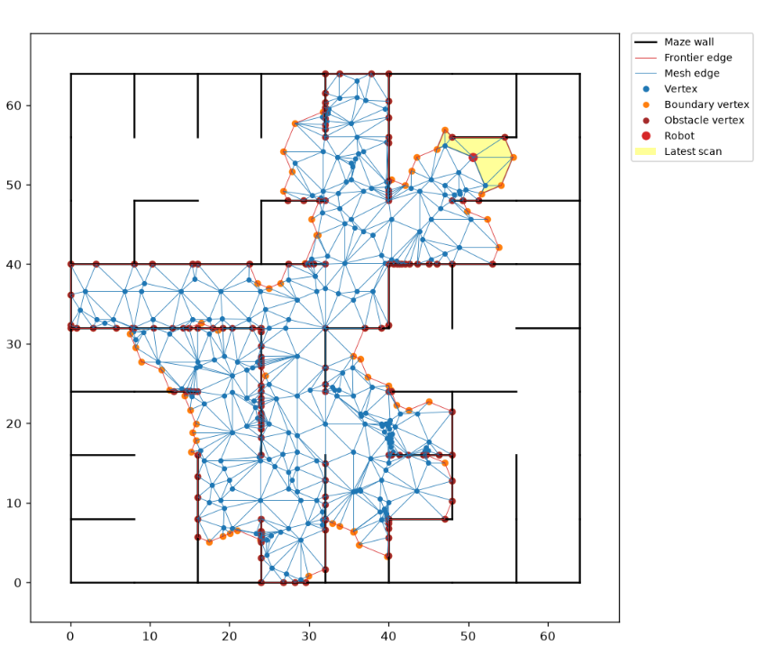
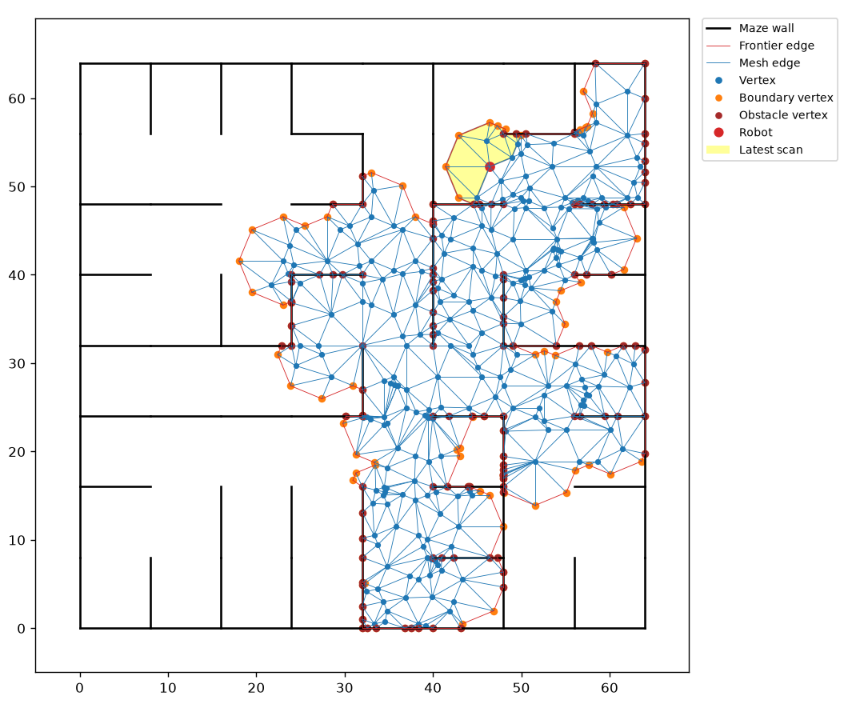
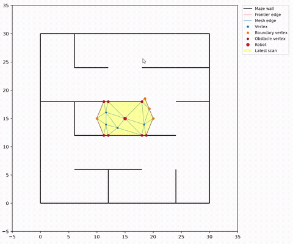

# TopoFrontierNav2D

A 2D simulation where a robot incrementally maps unknown space and autonomously navigates through it. Each scan's newly-visible region is triangulated (constrained Delaunay, via the [`triangle`](https://rufat.be/triangle/) library) and merged into a persistent topological mesh. The mesh boundary is tracked as an exploration frontier. The robot plans paths with A\* and drives toward unexplored frontier vertices until the space is fully mapped. Obstacles (currently a randomly generated maze) support raycasting-based visibility so scans respect line-of-sight.

This is **not** SLAM — the robot's position is known exactly (no sensor noise, no localization uncertainty, no loop closure). It's topological mapping, frontier-based exploration, and path planning, over ground-truth position.




A full run, start to finish:



## How it works

1. **Scan** — the robot casts a regular polygon "sensor" footprint around its position and intersects it with the environment (`Interactable.interact_scan`), clipping against any walls in line-of-sight.
2. **Triangulate** — the newly-visible region is constrained-Delaunay triangulated and stitched into the existing mesh (`Mesh`, a `networkx` graph of vertices/edges).
3. **Track the frontier** — mesh edges bordering only one triangle are boundary/frontier edges; vertices adjacent to a wall are marked as obstacle vertices.
4. **Navigate** — A\* plans a path from the robot's current vertex to an unexplored frontier vertex, treating obstacle-adjacent edges as high (not infinite) cost, so a frontier vertex is still reachable if the only way in is past an obstacle vertex. See `corner_cases/sealed_vertex/sealed_vertex_zoom.png` for the failure mode this fixes.
5. Repeat until no frontier remains — at that point the space is fully mapped.

## Running it

```
pip install -r requirements.txt
python simulation.py
```

Opens a live `matplotlib` animation of a robot exploring a randomly generated maze. Controls:

- **Space** — pause/resume
- **s** — save the current run as a replayable recording to `tests/fixtures/`
- **Click** a vertex to teleport the robot there

## Recording & replay

Runs auto-save to `tests/fixtures/_live_recovery.json` on every scan, and can be saved on demand with the `s` key. Saved recordings can be replayed deterministically:

```python
from robot import visualize_recording
visualize_recording('tests/fixtures/sample_run.json')
```

`tests/test_replay.py` replays every fixture in `tests/fixtures/` and asserts the resulting mesh is a valid polygon — this is the project's regression test suite.

## Project layout

- `robot.py` — everything: mesh/graph data structures, triangulation, frontier tracking, A\*, the `Maze` obstacle, and the `Simulator`/animation loop. (Splitting this into modules is a planned cleanup.)
- `simulation.py` — entry point for a live run.
- `grid_index.py` — a spatial grid index, not yet wired into `robot.py`.
- `tests/` — replay-based regression tests and fixtures.

## Status

Working end-to-end for a single robot exploring a static 2D maze. Known gaps / next steps:

- `robot.py` is a monolith and needs splitting into modules.
- No sensor noise or localization uncertainty (see note above on SLAM).
- Frontier selection picks the first reachable frontier vertex found, not the nearest one.
